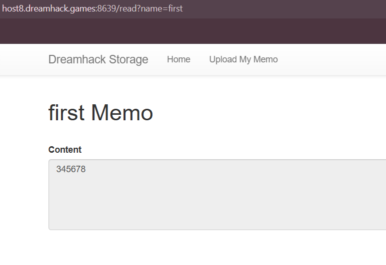
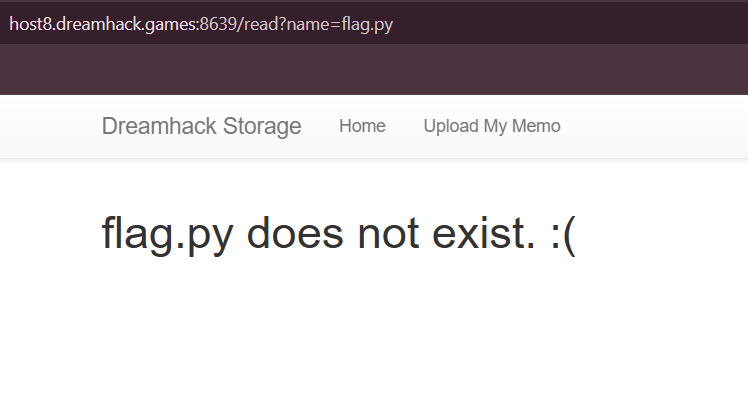
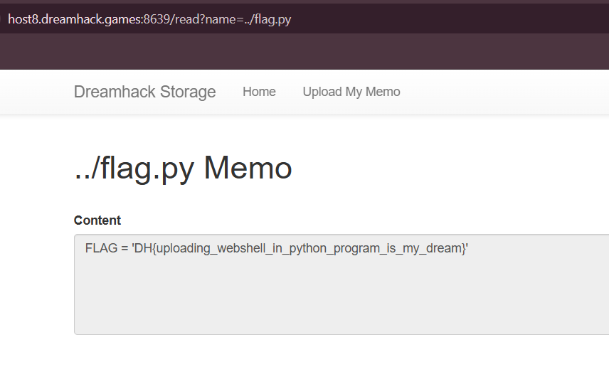

# Dreamhack CTF – file-download-1 (Web)

## Challenge Description
We are given a simple web challenge called **file-download-1**. The interface allowed us to create memos and later read them back. The challenge hinted at a file-download or path traversal issue.

---

## Recon
After creating a memo through the web interface, I noticed the URL used to read it looked like this:
http://host8.dreamhack.games:8639/read?name=memo-name



This suggested that the server was reading files from disk based on the `name` parameter.

---

## Exploitation
I tested whether arbitrary filenames could be passed to the `name` parameter. First, I tried directly requesting the flag file:


http://host8.dreamhack.games:8639/read?name=flag.py


The server responded that `flag.py` didn’t exist.



Next, I attempted **path traversal** by prepending `../` to escape the memo directory:


http://host8.dreamhack.games:8639/read?name=../flag.py


This time, the server successfully returned the contents of `flag.py`, which contained the challenge flag.



---

## Root Cause
The web application directly concatenated user input from the `name` query parameter into a file path without sanitization. This allowed arbitrary file access via `../` sequences (classic **directory traversal vulnerability**).

---

## Flag
```
DH{...}
```
